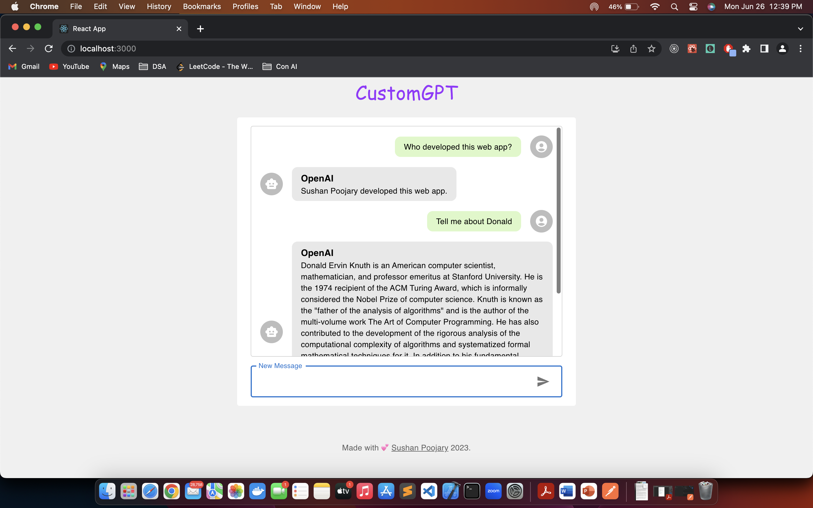

# ChatGPT - Custom data
Train GPT based on user file upload/input. This model is trained on Donald Knuth's Wikipedia page.
 
"gpt-3.5-turbo" is used.

Steps:
1. Replace or add multiple files(training data) in the data folder located in the backend.
2. Delete the index.json files in the main directory before running the flask server.
3. Install backend dependencies using virtualenv and pip/pip3.
4. Install frontend dependencies using npm i.
5. Insert your OpenAI API key in the CustomGPT.py file.
6. Run python file, this will initiate flask server.
7. Run frontend using npm start.

